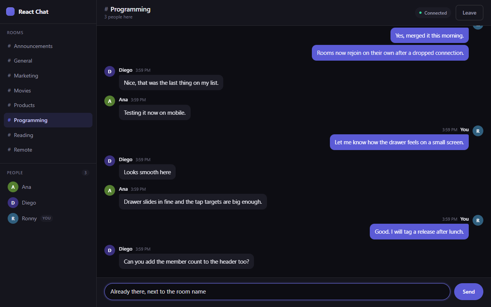
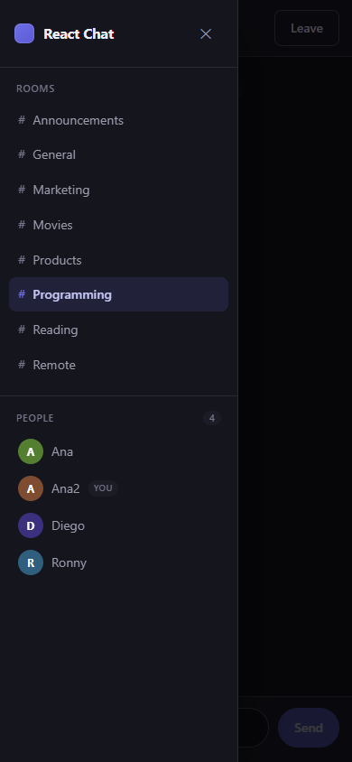

# React Chat App

Real time chat rooms built with React and Socket.IO. Pick a name, join one of the
eight rooms, and talk to everyone else who is in that room. Messages, the member
list, and the join and leave notices all update live over a WebSocket.



## What it does

- Eight rooms. You pick one when you join and can switch at any time from the sidebar.
- Live member list with a count in the room header.
- Notices when someone joins or leaves the room you are in.
- Your own messages sit on the right, everyone else on the left, and messages sent
  back to back by the same person are grouped under one name.
- Switching rooms reuses the same connection and starts the new room with a clean
  message list.
- If the connection drops, the header says so and the app rejoins the room by itself
  once the server is back.
- Works on a phone. The sidebar becomes a drawer and every control stays large
  enough to tap.

<p align="center">
  
</p>

## Tech stack

**Client:** React 19, TypeScript 5.9, Vite 8, React Router 7, Socket.IO client 4.8

**Server:** Node 22, Express 5, Socket.IO 4.8, TypeScript 5.9

**Tooling:** Vitest, Testing Library, ESLint 10, Prettier 3, tsx

## Running it locally

You need Node 22.12 or newer. The client and the server are separate npm packages,
so each one gets its own install.

Start the server first:

```sh
cd server
npm install
cp .env.example .env
npm run dev
```

Then the client, in a second terminal:

```sh
cd client
npm install
cp .env.example .env
npm run dev
```

The client runs on http://localhost:5173 and the server on http://localhost:4000.
Open the client in two browser windows to talk to yourself, which is the quickest
way to see it working.

## Environment variables

Both files are optional. The code falls back to the values below when they are missing.

**server/.env**

| Name | Default | What it does |
| --- | --- | --- |
| `PORT` | `4000` | Port the API and the socket server listen on. |
| `CLIENT_URL` | `http://localhost:5173` | Origins allowed to connect. Comma separated if you need more than one. |

**client/.env**

| Name | Default | What it does |
| --- | --- | --- |
| `VITE_API_URL` | `http://localhost:4000` | Where the client looks for the chat server. |

## Scripts

Both packages share the same script names.

| Script | What it does |
| --- | --- |
| `npm run dev` | Start in watch mode. Vite for the client, tsx for the server. |
| `npm run build` | Build for production. Vite bundle for the client, compiled JS in `dist` for the server. |
| `npm test` | Run the test suite once with Vitest. |
| `npm run test:watch` | Run the tests in watch mode. |
| `npm run lint` | Check the code with ESLint. |
| `npm run typecheck` | Check types without emitting anything. |
| `npm run format` | Format with Prettier. |

The client also has `npm run preview` to serve the production build, and the server
has `npm start` to run the compiled output.

## How it works

The client keeps one Socket.IO connection for the whole tab. It is created once in
`client/src/lib/socket.ts` and reused across routes, so moving between the join
screen and a room never drops the connection.

```
Browser                          Server
  Home  ---- join ------------->  addUser, socket.join(room)
                                  |
  Chat  <--- message -----------  generateMessage + broadcast to the room
        <--- roomUsers ---------  everyone currently in that room
        ---- sendMessage ------>  validate, then send to the room
        ---- leave ------------>  removeUser, socket.leave(room)
```

### The socket contract

Events are typed on both sides. The client version lives in
`client/src/types/events.ts` and the server version in `server/src/types/events.ts`.

| Event | Direction | Payload |
| --- | --- | --- |
| `join` | client to server | `{ username, room }` plus a callback that gets an error string if the join fails |
| `sendMessage` | client to server | the message text, plus an optional callback for errors |
| `leave` | client to server | nothing |
| `message` | server to client | `{ username, text, createdAt }` |
| `roomUsers` | server to client | the list of people in your room |

A few details worth knowing:

- The server assigns the socket id itself. The client never sends one, so nobody can
  claim to be another connection.
- `createdAt` is an ISO timestamp. The client formats it in the reader's own locale,
  so the time shown is the time where you are.
- Joining is idempotent. Joining the room you are already in just resends the member
  list, and joining a different room leaves the old one first. One socket is only ever
  in one room.
- The server validates every join and message: the room has to be on its list, the
  username has to be free in that room and at most 20 characters, and messages are
  trimmed and capped at 500 characters.

### State

Connected users live in a `Map` in `server/src/models/user.ts` and nothing is written
to disk. Restarting the server empties every room. It also assumes a single process,
since a second instance would have its own map and its own rooms. Putting this behind
a Redis adapter is what you would do before running more than one.

The room list exists in two places on purpose: `client/src/data/rooms.ts` renders the
picker, and `server/src/utils/rooms.ts` decides what the server will accept. Add a
room to both.

On the client, the room view is mounted with a key that includes the room name, so
switching rooms remounts it and the new room starts with empty state instead of
clearing it by hand.

## Project structure

```
client/
  src/
    components/   chat header, message list, composer, sidebar, avatar
    data/         the room list the picker renders
    hooks/        useChatRoom, useConnection, useAutoScroll
    lib/          the shared socket instance
    pages/        Home (join form) and Chat (reads the URL, mounts the room)
    types/        message, user and the socket event contract
    utils/        time formatting and avatar colors
server/
  src/
    models/       the in memory user store
    types/        message, user and the socket event contract
    utils/        room list, message builder, shared strings
    server.ts     express app, CORS, and the socket handlers
    index.ts      starts the server and handles shutdown
```

## Tests

```sh
cd server && npm test
cd client && npm test
```

The server tests cover the user store and the room and message helpers. The client
tests cover the join form, including the error the server sends back for a name that
is taken, and how the message list groups messages and marks your own.

## License

MIT
